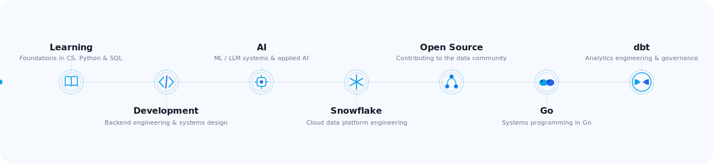
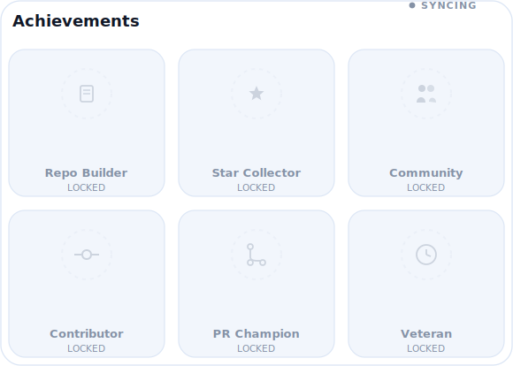

<picture>
  <source media="(prefers-color-scheme: dark)" srcset="assets/banner-dark.svg">
  <source media="(prefers-color-scheme: light)" srcset="assets/banner-light.svg">
  
</picture>

  

 

<picture>
  <source media="(prefers-color-scheme: dark)" srcset="assets/profile-card-dark.svg">
  <source media="(prefers-color-scheme: light)" srcset="assets/profile-card-light.svg">
  
</picture>

 

## About Me

I'm an **Associate Software Engineer at PibyThree**, building enterprise-grade **data and AI platforms** on top of the modern data stack. My work sits at the intersection of **data engineering, cloud platform design, and applied AI** — turning raw, messy, multi-source data into governed, trustworthy systems that enterprises can build products on.

- 🧠 **Enterprise AI** — designing agentic and LLM-powered systems for document understanding, fraud detection, and retrieval over structured + unstructured data
- ❄️ **Snowflake** — ingestion frameworks, governance, access control, lineage, and performance engineering at scale
- 🔧 **dbt & Analytics Engineering** — metadata-driven transformation, testing, and data quality as code
- 🌐 **Open Source** — contributing back to the dbt and data engineering community
- ⚙️ **Automation & Platform Engineering** — Go services, Airflow orchestration, and infrastructure-as-code with Terraform
- ☁️ **Cloud** — AWS and Databricks across production data platforms

I care about building systems that are **observable, governed, and quietly reliable** — the kind of infrastructure enterprises don't have to think about because it simply works.

 

## Tech Stack

<picture>
  <source media="(prefers-color-scheme: dark)" srcset="assets/techstack-dark.svg">
  <source media="(prefers-color-scheme: light)" srcset="assets/techstack-light.svg">
  
</picture>

 

## GitHub Stats

<table align="center">
<tr>
<td valign="top" width="50%">

<picture>
  <source media="(prefers-color-scheme: dark)" srcset="assets/stats-dark.svg">
  <source media="(prefers-color-scheme: light)" srcset="assets/stats-light.svg">
  
</picture>

</td>
<td valign="top" width="50%">

<picture>
  <source media="(prefers-color-scheme: dark)" srcset="assets/languages-dark.svg">
  <source media="(prefers-color-scheme: light)" srcset="assets/languages-light.svg">
  
</picture>

</td>
</tr>
</table>

 

## Featured Projects

<picture>
  <source media="(prefers-color-scheme: dark)" srcset="assets/projects-dark.svg">
  <source media="(prefers-color-scheme: light)" srcset="assets/projects-light.svg">
  
</picture>

 

## Career Timeline

<picture>
  <source media="(prefers-color-scheme: dark)" srcset="assets/timeline-dark.svg">
  <source media="(prefers-color-scheme: light)" srcset="assets/timeline-light.svg">
  
</picture>

 

## Open Source

I contribute upstream to **dbt-core** and community packages — improving macros, tests, and documentation for the analytics engineering ecosystem — and maintain internal-turned-public tooling around Snowflake governance and data ingestion.

 

## Achievements

<picture>
  <source media="(prefers-color-scheme: dark)" srcset="assets/trophies-dark.svg">
  <source media="(prefers-color-scheme: light)" srcset="assets/trophies-light.svg">
  
</picture>

 

## Contribution Graph

<picture>
  <source media="(prefers-color-scheme: dark)" srcset="https://raw.githubusercontent.com/DipakMandlik/DipakMandlik/output/github-snake-dark.svg">
  <source media="(prefers-color-scheme: light)" srcset="https://raw.githubusercontent.com/DipakMandlik/DipakMandlik/output/github-snake.svg">
  
</picture>

 

<strong>How this profile stays alive</strong>

 

Every animated asset in this README is a self-contained SVG — no third-party image services, no external rendering APIs. Two GitHub Actions keep it current:

- **`update-stats.yml`** runs `.github/scripts/generate_profile_assets.py` on push and on a daily schedule, pulling real numbers from the GitHub REST + GraphQL APIs and re-rendering `stats-*.svg`, `languages-*.svg`, and `trophies-*.svg` in place. Repo and star counts work out of the box; for contribution / PR / issue totals, add a fine-grained personal access token with **read-only profile access** as a repository secret named `GH_STATS_TOKEN`.
- **`snake.yml`** renders the contribution calendar into the animated snake every 12 hours and publishes it to the `output` branch.

Until the first scheduled run completes after upload, the stats and achievement cards render an honest **"syncing"** state rather than placeholder numbers.

 

Designed &amp; built by Dipak Mandlik · PibyThree · Data + AI Platform Engineering

